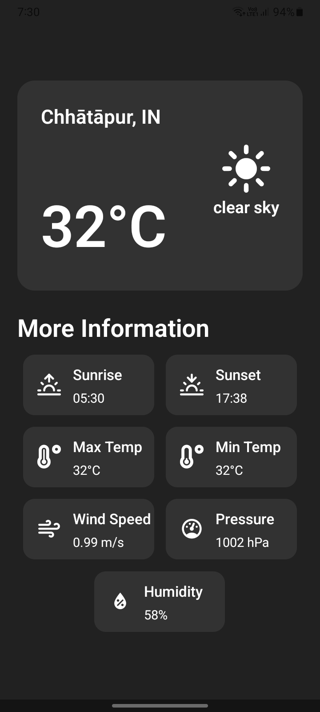

# Weather App 🌤️

A simple React Native app built with Expo to fetch current weather data using the device's location.

## Features

- Fetch weather by current location (latitude & longitude).
- Shows temperature, min/max, humidity, pressure, wind speed, sunrise/sunset.
- Displays a weather icon according to the current conditions.
- Includes retry if location permission is denied.

## [Download App](https://expo.dev/accounts/dilkhush9060/projects/weather_app/builds/635b7fa6-3395-42fe-8fe7-bc9a80eb2710)

## Install And Run

1. **Clone the repository**

```bash
git clone https://github.com/dilkhush9060/weather_app.git
cd weather_app
```

2. **Install Dependencies**

```bash
bun install
```

3. **Add Env file .env**

```bash
EXPO_PUBLIC_OPEN_WEATHER_API_KEY="your api key from open weather"
```

4. **Run App**

```bash
bun start
```

## Screenshots


